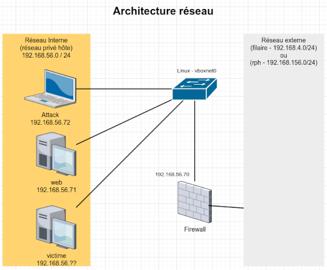

# css_tp_securite

Les fichiers pour la mise en place du TP Sécurité pratique

## Les pré-requis

### Les ressources informatiques

Pour faire fonctionner ce Labs il faut prévoir au moins 6 CPU /coeurs et 4Go de Ram (8Go est plus judicieux). L'espace disque est de l'ordre des 16 Go.
La virtualisation doit être activée sur le PC hôte (machine physique ) https://support.bluestacks.com/hc/fr-fr/articles/115003174386-Comment-puis-je-activer-la-virtualisation-VT-sur-mon-PC-

### Les applications obligatoires

* Oracle Virtualbox (<https://www.virtualbox.org/wiki/Downloads>)
* Oracle VM VirtualBox Extension Pack (<https://www.virtualbox.org/wiki/Downloads>)
* HashiCorp Vagrant (<https://developer.hashicorp.com/vagrant/install?product_intent=vagrant>) (winget install vagrant sous Windows)

### Les fichiers obligatoires

* choisir le zip en haut à droite (< Code >)
* cloner avec git : 
```shell
git clone https://github.com/chavinje/css_tp_securite.git
```

Vous trouverez les reperoires/fichiers :

* ./Vagrantfile : qui contient l'ensemble des déclarations pour la construction du Labs
* Docs : avec les schémas et documents suplémentaires
* scripts/install_sys.sh : exécuté lors de la création de toute les VMs. En théorie il n'y a rien a modifier.
* scripts/install_fw.sh : un script vide puisque c'est à vous de le remplir
* scripts/install_attack.sh : pas grand chose. Met en place Kali Linux "Rolling release" 
* scripts/install_web.sh : install le serveur web en installant et configurant la solution DVWA (https://github.com/digininja/DVWA)

## Description du Labs

Le labs est constitué de 4 machines virtuelles Virtualbox.
Une machine servira pour relier le labs à votre réseau réel (firewall). Attention si le bridge se fait sur l'interface Wifi de a machine, cela ne marchera pas. Dans ces conditions, préférer un autre réseau privé hôte (192.168.156.0/24 par exemple)

### le premier ensemble

<b>Hôte</b> <= Bridge => <b>firewall</b> <= réseau privé 56 => <b>attack / web / victime </b>

* __firewall__ : machine virtuelle avec 2 interfaces en plus du NAT pour vagrant
  * __enp0s3__ : NAT (vagrant)
  * __enp0s8__ : réseau privé hôte pour l'intéraction entre les machines du réseau Labs (192.168.56.70/24)
  * __eth2__ : réseau bridge pour l'ilustration du principe de firewall et de reverse proxy
* __web__ : un serveur web simple contenant le site DVWA
  * __enp0s3__ : NAT (vagrant)
  * __enp0s8__ : réseau privé hôte (192.168.4.71/24)
* __attack__ : Distribution Kali Linux actuelle. Attention pour obtenir l'interface graphique il faut passer par virtualbox
  * __eth0__ : NAT (vagrant)
  * __eth1__ : réseau privé hôte (192.168.4.72/24)
* __victime__ : Windows XP La machine à attaquer avec Metasploit. Une fois le vagrant up et il faut modifier la carte réseau de la machine virtuelle pour la faire pointer sur le vboxnet adéquat.
  * __carte 1__ : réseau privé hôte (192.168.56.xx/24)



## Utilisation des commandes vagrant

Télécharger la box modèle
```shell
vagrant box add chavinje/fr-bull-64
```

Activer une VM uniquement (attack par exemple)
```shell 
    vagrant up attack
```

Se connecter à une VM (firewall par exemple)
```shell
    vagrant ssh firewall
```

Arréter une VM
```shell
    vagrant halt victime
```

Détruire toutes les VMs (sans demande de confirmation)
```shell
    vagrant destroy -f
```
